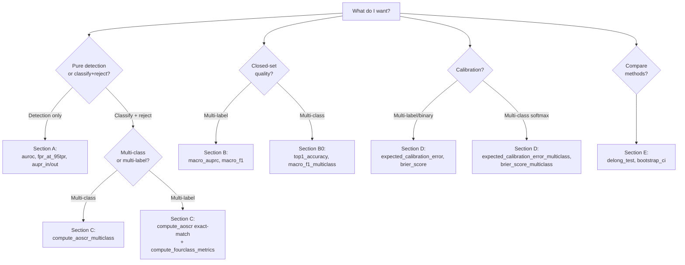

# Which Metric Should I Use?

A decision guide. Answer three questions in order — the answers narrow
down to a small set of functions.

## Step 1: What is your task type?

| Task type | What it means | Closed-set metrics to use |
|---|---|---|
| **Multi-class (single-label)** | Each sample has **one** ground-truth class out of K. Output is a softmax. | `top1_accuracy`, `macro_f1_multiclass`, `balanced_accuracy` |
| **Multi-label** | Each sample can have **multiple** positive labels. Output is per-label sigmoid. | `macro_auprc`, `macro_f1_with_thresholds`, `per_label_auprc`, `f1_per_label` |
| **Regression / density / open-world** | Continuous targets, density estimation, or continual learning | Out of scope — use a different library |

## Step 2: What is your goal?

| Goal | What you want to know |
|---|---|
| **Pure OOD detection** | "Can my detector tell ID from OOD?" — binary score is enough; closed-set predictions not required |
| **Open-Set Recognition (OSR)** | "Does my classifier correctly classify known classes **and** reject unknown classes?" — joint metric (needs both score and class prediction) |
| **Calibration** | "When my model says P=0.7, is the empirical rate really 70%?" |
| **Statistical comparison** | "Is method A's AUROC significantly higher than method B's?" |

## Step 3: Look up the function

After you know your task type and goal, the **capability matrix in
`README.md`** gives you the function list at a glance. The decision
tree below provides the exact call signatures.

## Conventions (read these once)

- **Score direction**: every OOD/novelty score in this library follows
  **higher = more OOD**. ID-positive metrics (`aupr_in`) handle the sign
  internally; you don't need to flip the sign yourself.
- **Multi-label probabilities**: use **sigmoid (per-label)**, not softmax.
- **Pairing comparisons**: when comparing methods on the same data, always
  use the same seed split.

## Decision flowchart



## Decision tree

### A. I have OOD scores and binary OOD labels — how good is my detector?

| Question | Function |
|---|---|
| Threshold-free separability — single number for the headline | `auroc(scores, labels)` |
| Operating-point cost — false alarms when 95% of OOD is caught | `fpr_at_95tpr(scores, labels)` or `fpr_at_tpr(scores, labels, target_tpr=0.95)` |
| Asymmetric PR — quality of OOD-suspicious ranking | `aupr_out(scores, labels)` |
| Asymmetric PR — quality of ID-confident ranking | `aupr_in(scores, labels)` |

### B0. I have multi-class (single-label) predictions — how good is my closed-set classifier?

| Question | Function |
|---|---|
| Top-1 accuracy from logits or class IDs | `top1_accuracy(preds, y)` |
| Macro-F1 (equal weight per class, robust to imbalance) | `macro_f1_multiclass(preds, y)` |
| Class-balanced accuracy (mean per-class recall) | `balanced_accuracy(preds, y)` |

All three accept either integer predictions `[N]` or a softmax / logit
matrix `[N, K]` — no need to `argmax` yourself.

### B. I have multi-label predictions — how good is my closed-set classifier?

| Question | Function |
|---|---|
| Threshold-free, equal weight per label | `macro_auprc(probs, labels)` |
| Same, but exclude held-out labels (avoid all-zero AUPRC penalty) | `macro_auprc_id_labels(probs, labels, label_names, held_out_labels)` |
| Operating-point F1 with a single threshold per label | `macro_f1_with_thresholds(probs, labels, thresholds)` |
| Per-label diagnostics | `per_label_auprc(probs, labels)` and `f1_per_label(preds, labels)` |

### C. I have held-out labels — how do I report Open-Set Recognition results?

The headline number is **AOSCR**: it jointly evaluates classification
correctness on accepted ID samples vs OOD-rejection rate.

**Multi-class (single-label)** — pass logits or class IDs:

```python
from osr_metrics import compute_aoscr_multiclass
aoscr = compute_aoscr_multiclass(novelty_scores, ood_labels, logits_NK, y_N)
# or with integer predictions:
aoscr = compute_aoscr_multiclass(novelty_scores, ood_labels, preds_N, y_N)
```

**Multi-label** — pass an exact-match indicator (1 if all labels
predicted correctly, else 0):

```python
import numpy as np
from osr_metrics import compute_aoscr
exact_match = (preds == labels).all(axis=1).astype(int)
aoscr = compute_aoscr(novelty_scores, ood_labels, exact_match, np.ones_like(exact_match))
```

For a richer view, get all five AUROC pairings in one call:

```python
from osr_metrics import compute_fourclass_metrics
m = compute_fourclass_metrics(ood_scores, label_vecs, label_names, held_out_labels)
```

Then pick the keys you want to report:

| Key | Report this when |
|---|---|
| `auroc_full` | You want the single headline OOD AUROC over the full population |
| `auroc_pure` | You want the cleanest "can the score detect held-out content?" number |
| `auroc_mixed` | You want to show how mixed-OOD (known + unknown co-present) is detected |
| `auroc_mixed_vs_id_disease` | You want near-OOD sensitivity with NF removed from negatives |
| `auroc_nf_vs_pure` | Diagnostic: floor case (healthy vs unknown disease) |
| `auroc_disease_only` | Backward-compatible legacy: ID-disease vs all OOD, NF excluded |

### D. I want to know if my probabilities are calibrated

Pick the row that matches your task type:

| Task type | Question | Function |
|---|---|---|
| Multi-label / binary | Per-label P=0.7 hits 70% empirical rate? | `expected_calibration_error(probs, labels)` |
| Multi-label / binary | Combined calibration + sharpness | `brier_score(probs, labels)` |
| Multi-class softmax | Top-1 confidence well-calibrated? (Guo 2017 form) | `expected_calibration_error_multiclass(probs, y)` |
| Multi-class softmax | Multi-class Brier (one-hot vs softmax) | `brier_score_multiclass(probs, y)` |

### E. I want to compare two methods statistically

| Situation | Function | Notes |
|---|---|---|
| Same seed, same data, two different methods | `delong_test(scores_a, scores_b, labels)` | Paired AUROC test (DeLong 1988). Returns (z, p). |
| One method, want a CI on its AUROC | `bootstrap_ci(scores, labels, auroc, n_bootstrap=1000)` | Use `stratify=True` if classes are very imbalanced. |
| Multiple seeds, want the mean ± std | `np.std([auroc per seed], ddof=1)` | One line, no library function needed. |

### F. I want a healthy-patient false-alarm number

```python
from osr_metrics import compute_nf_rejection_at_tpr
rej = compute_nf_rejection_at_tpr(scores, ood_labels, nf_labels, tpr=0.95)
```
Calibrates the threshold on ID-disease at TPR=0.95, then reports the rate at
which NF (no-finding, healthy) images are rejected by that threshold. Higher
= better (healthy patients flagged for review rather than auto-classified).

## Common mistakes

See [`PITFALLS.md`](PITFALLS.md) for the full list with bad-vs-good
code side by side. The most-hit ones:

1. **Forgetting score direction** — wrap confidence scores once with
   `as_ood_scores(scores, direction="confidence")`.
2. **AOSCR on multi-label without an exact-match indicator** — use
   `compute_aoscr_multiclass` for multi-class, or pass
   `(preds == labels).all(axis=1)` for multi-label.
3. **Multi-class softmax through `expected_calibration_error`** — use
   `expected_calibration_error_multiclass` instead.
4. **Bootstrapping without `stratify=True`** on imbalanced data.
5. **DeLong on different splits** — DeLong is paired; both methods
   must score the same samples.
6. **`auroc_pure` as the headline** — it's a diagnostic upper bound;
   pair with `auroc_full`.

## Putting it together: the full publication panel

The metric panel for OSR papers (see `evaluation-metrics-panel.md` in the
parent project repo for the full table, ranked by must/should/nice):

```python
from osr_metrics import (
    auroc, fpr_at_95tpr, aupr_in, aupr_out,
    macro_auprc, macro_f1_with_thresholds,
    compute_aoscr, compute_fourclass_metrics, compute_nf_rejection_at_tpr,
    expected_calibration_error, brier_score,
    delong_test, bootstrap_ci,
)
```

That covers all 19 rows of the panel.
